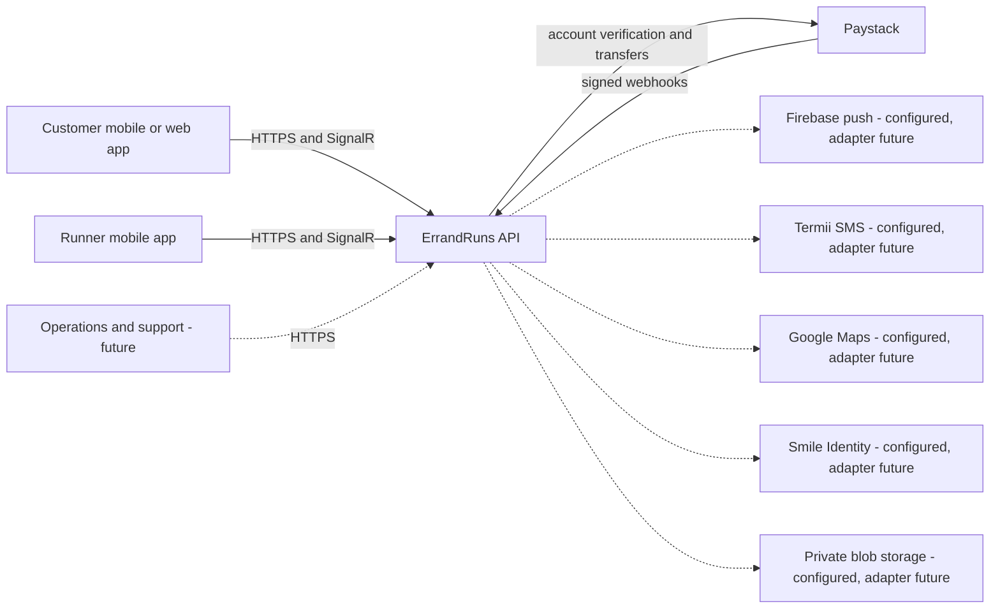
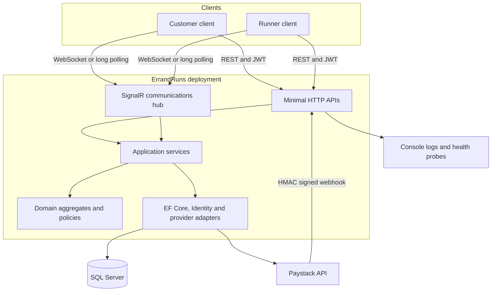
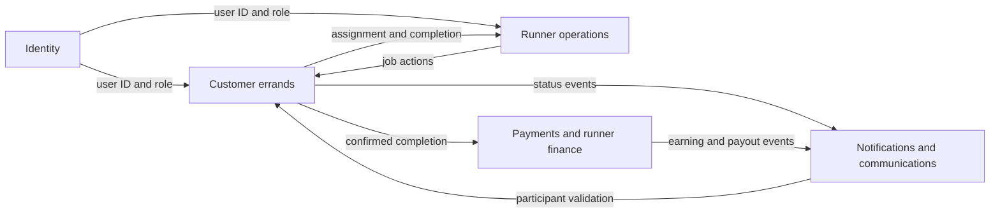
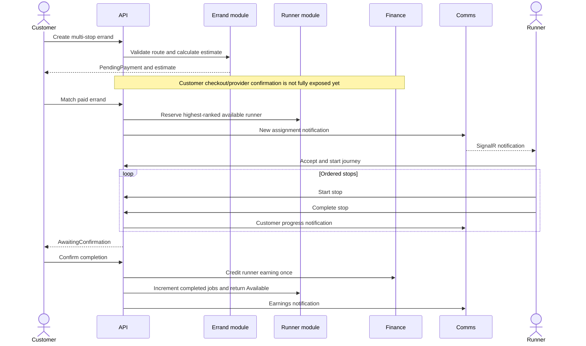
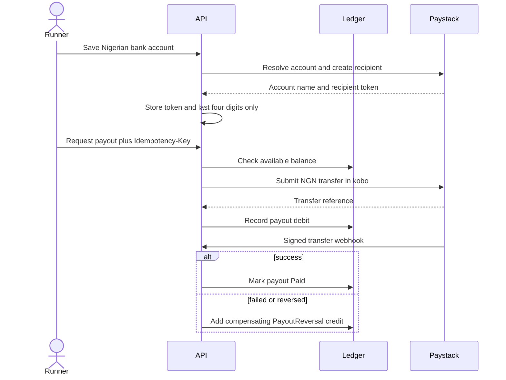
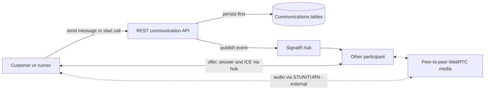
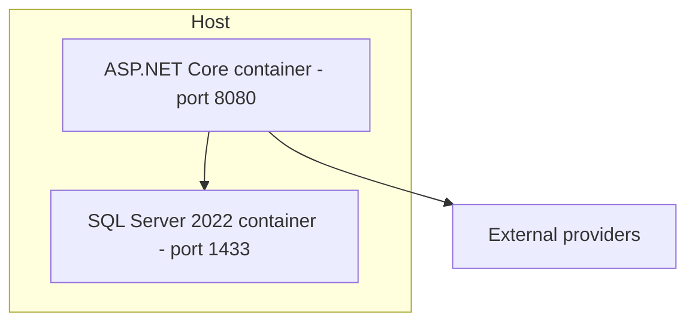
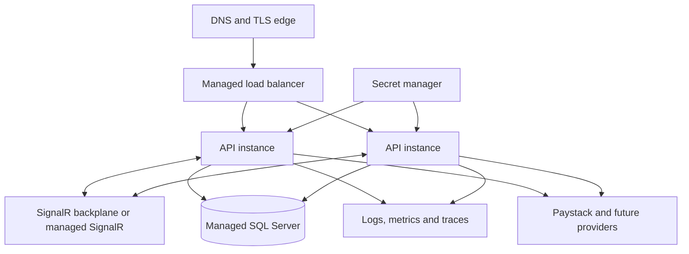

# ErrandRuns high-level system design

The image above is the quick visual overview. The diagrams below break each subsystem down in more detail.

## 1. Purpose and scope

ErrandRuns is a Lagos-focused marketplace in which customers submit multi-stop errands, verified runners execute them, and the platform coordinates identity, matching, progress, communications, payment settlement, and runner payouts.

The current backend is a .NET 10 modular monolith. It is one deployable process, but code boundaries and SQL schemas separate the major business capabilities. This keeps the first production version operationally simple while preserving clear extraction points if individual modules later need independent scaling.

This document describes the implemented backend and labels future components explicitly.

## 2. System context

Solid lines are implemented interactions. Dashed lines show configured extension points whose complete business adapters are not yet implemented.

## 3. Container view

### Container responsibilities

| Container | Responsibility |
|---|---|
| HTTP API | Versioned endpoints, request binding, role policies, rate limiting, Problem Details and OpenAPI |
| SignalR hub | Authenticated real-time notifications, messages, read receipts and WebRTC signaling |
| Application layer | Use-case orchestration, ownership checks, repository/provider contracts and response mapping |
| Domain layer | Errand, runner, money, payment, payout, messaging, notification and call invariants |
| Infrastructure layer | SQL Server persistence, ASP.NET Core Identity and Paystack payout integration |
| SQL Server | Durable system of record, optimistic concurrency, indexes and uniqueness constraints |

## 4. Logical module view

| Module | Implemented capabilities |
|---|---|
| Identity | Customer/runner registration, email-or-phone login, JWTs, profiles, password change and reset |
| Errands | Categories, items, ordered stops, estimates, ownership, active/history, matching, tracking and completion |
| Runners | Verification submission, availability, assigned jobs, sequential execution and dashboard |
| Finance | Payment model, runner earning ledger, payout accounts, Paystack transfers and reconciliation |
| Communications | Persistent notifications, conversations, messages, read receipts, call lifecycle and real-time events |

## 5. Principal end-to-end flow

## 6. Runner payout flow

## 7. Communications architecture

REST is the durable control plane; SignalR is the low-latency delivery plane.

Messages and call metadata survive disconnects because they are stored before broadcast. Audio is not proxied through the API. Production voice calling requires client WebRTC support and STUN/TURN infrastructure or a telecom provider.

## 8. Deployment topology

### Current local/container deployment

The API image is built in a .NET SDK stage and runs as a non-root user in the ASP.NET runtime image. Docker Compose waits for SQL Server health before starting the API and applies migrations only in Development.

### Recommended production deployment

Multiple API instances require a SignalR backplane or managed SignalR service; otherwise users connected to different instances will miss live events. SQL Server remains the authoritative state.

## 9. Security boundaries

- JWT bearer authentication identifies a stable GUID and `Customer` or `Runner` role.
- Endpoint role policies provide coarse authorization; application services enforce resource ownership.
- Conversation and call access requires membership in the assigned errand.
- Password hashing and credential verification are delegated to ASP.NET Core Identity.
- Paystack webhooks use an HMAC-SHA512 signature and constant-time comparison.
- Raw bank account numbers are forwarded to Paystack but not stored.
- Sensitive endpoints use fixed-window rate limiting.
- Errors use RFC 7807 responses and suppress internal details for HTTP 500.
- Development-only Swagger, in-memory persistence and simulated payouts must not be enabled in production.

## 10. Availability and failure behavior

| Failure | Current behavior | Recommended evolution |
|---|---|---|
| SQL unavailable | Readiness probe fails; durable requests fail | Managed SQL, backups, retry policy for transient faults |
| Client disconnects | Durable messages remain in SQL | Push notifications for offline recipients |
| SignalR instance loss | Client reconnects; REST can recover state | Managed SignalR/backplane and connection retry |
| Paystack request fails | Payout becomes Failed and no debit remains | Background retry for safe provider failures |
| Transfer later fails | Signed webhook adds compensating credit | Reconciliation job to detect missed webhooks |
| Duplicate payout request | Unique runner/idempotency-key returns original payout | Retain idempotency records per financial policy |
| Concurrent aggregate update | SQL rowversion detects conflict | Map concurrency exceptions to HTTP 409 explicitly |

## 11. Scaling strategy

1. Scale the modular monolith horizontally behind a load balancer.
2. Add a SignalR backplane and transactional outbox before multiple API instances.
3. Add caching only to read-heavy static data such as categories and bank lists.
4. Move location updates to a dedicated tracking store when write volume warrants it.
5. Extract communications or tracking only when independent scaling provides measurable value.
6. Keep identity and financial ledgers strongly consistent even if other modules become asynchronous.

## 12. Known gaps

- Customer checkout initialization and payment-collection webhook flow are not fully exposed.
- Runner approval/admin operations are not implemented; runners can submit verification only.
- Distance, time, zone, complexity and urgency pricing are not calculated.
- Firebase, Termii, maps, KYC and blob-storage options exist, but full adapters remain future work.
- There is no transactional outbox, so a database commit can succeed immediately before a real-time publish fails.
- Real-time geographic tracking and production WebRTC STUN/TURN infrastructure are not included.
- Reviews, disputes, refunds, saved locations and support workflows remain future modules.
