# ErrandRuns low-level system design

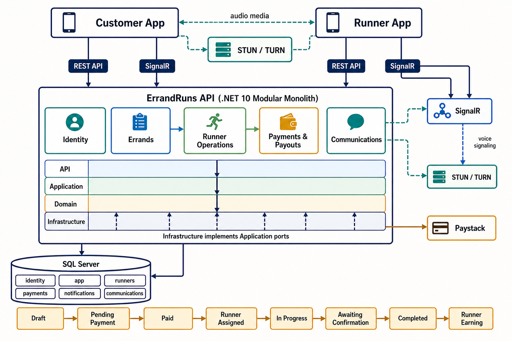

Use the overview image for orientation, then use the class, state, entity, and sequence diagrams below for implementation detail.

## 1. Code organization and dependencies

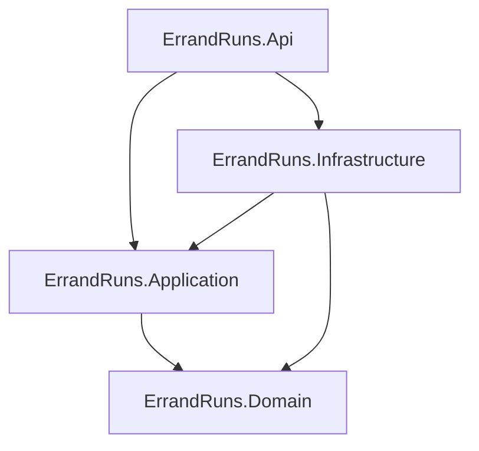

`Domain` has no dependency on HTTP, EF Core or infrastructure. `Application` defines use cases and ports. `Infrastructure` implements persistence, Identity and provider ports. `Api` binds transports and composes dependencies.

Architecture tests reject Domain references to API/Infrastructure and Application references to API/Infrastructure.

## 2. Main types

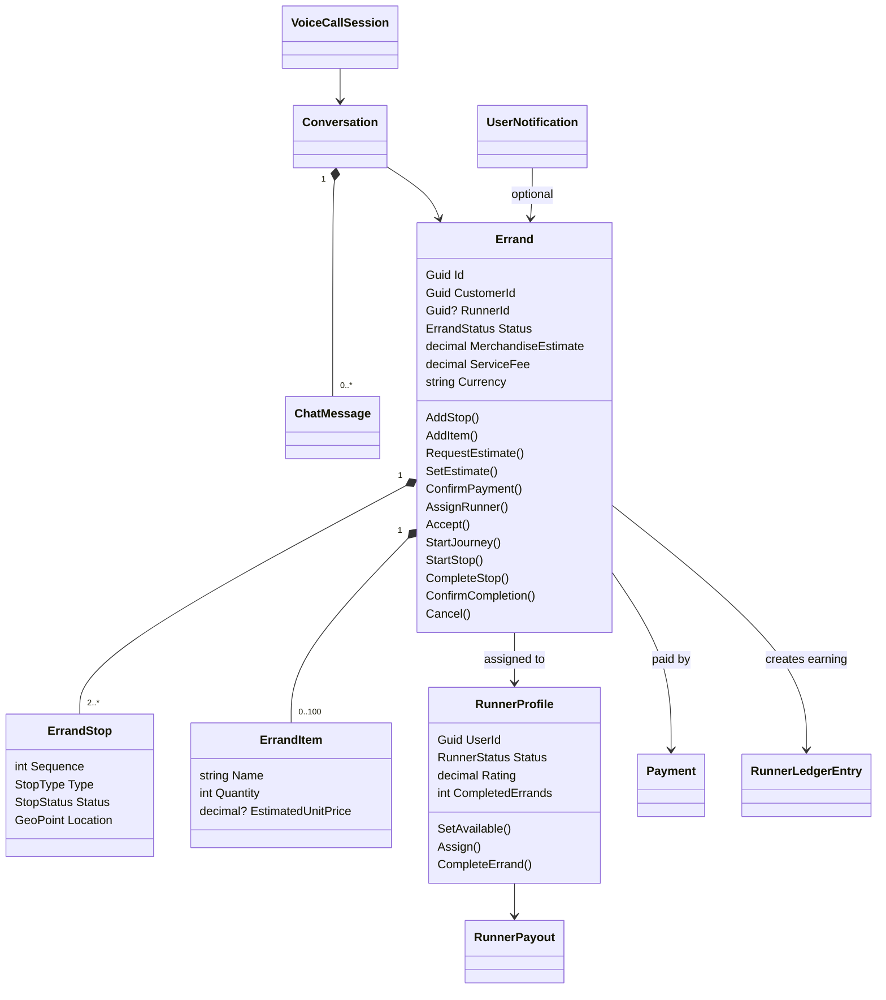

## 3. Application services and ports

| Service | Primary responsibilities | Ports used |
|---|---|---|
| `IdentityAuthenticationService` | Registration, credentials, profiles and password recovery | Identity managers, DbContext |
| `ErrandService` | Create/list/read errands, matching, execution, completion and notifications | Errand, runner, finance repositories; pricing; matching; notifications |
| `RunnerService` | Dashboard, verification submission, availability and job reads | Runner, errand and finance repositories |
| `RunnerFinanceService` | Earnings reads, payout account, withdrawals and reconciliation | Finance repository, payout gateway |
| `NotificationService` | Persist, list and mark notifications; real-time publish | Communication repository, SignalR port |
| `MessagingService` | Create participant conversation, send/read messages | Communication and errand repositories, notification/realtime ports |
| `VoiceCallService` | Start, answer, decline and end call metadata | Communication repository and realtime port |

The repository interfaces are declared in Application. Concrete EF implementations are scoped to one HTTP request and share one `ErrandRunsDbContext`, allowing related changes to commit together when one final `SaveChanges` is used.

## 4. Errand state machine

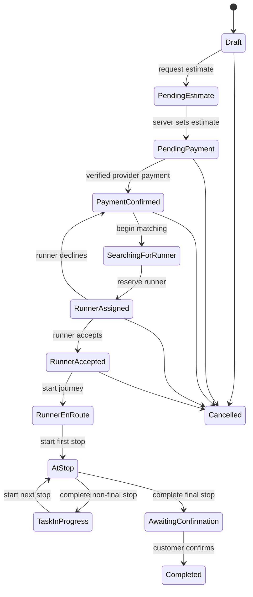

The aggregate does not accept arbitrary status assignments. Every transition is a named method with authorization performed in the application layer and invariants in the domain layer.

## 5. Runner state machine

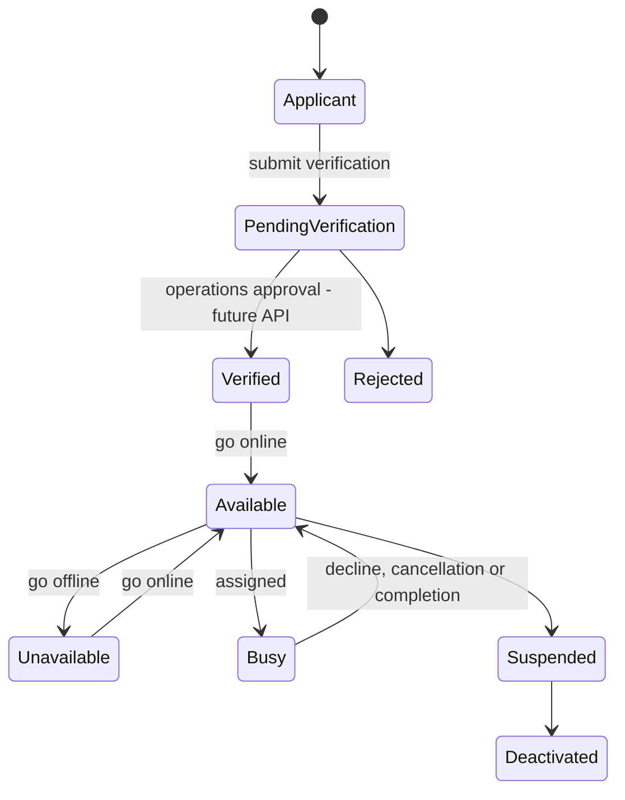

Matching reads only `Available` runners. Ranking is rating descending, then completed errands descending. Geographic/service-zone filtering is not yet part of the query.

## 6. Voice-call state machine

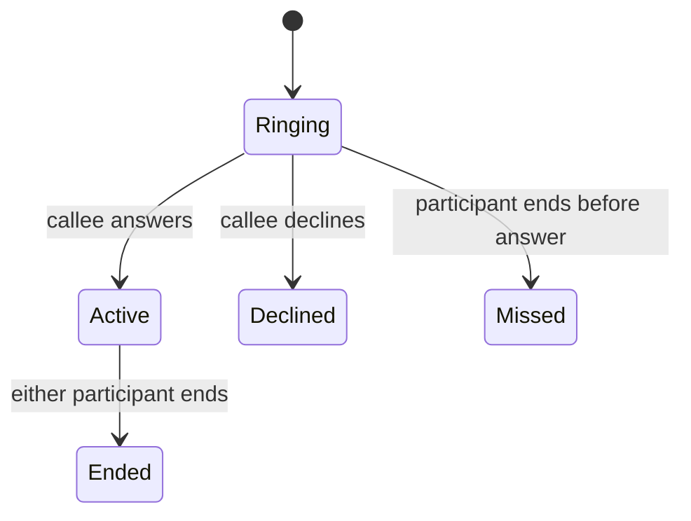

Call records store lifecycle metadata only. SDP offers, SDP answers and ICE candidates are transient SignalR messages; audio is carried peer-to-peer by WebRTC.

## 7. Relational data model

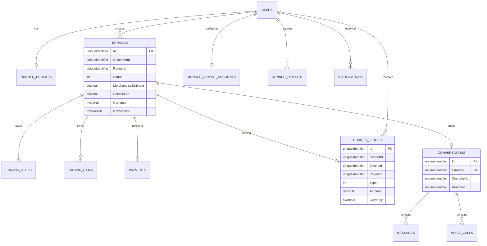

### SQL schema ownership

| Schema | Tables |
|---|---|
| `identity` | Users, Roles, UserRoles, claims, logins and tokens |
| `app` | Errands, ErrandStops and ErrandItems |
| `runners` | RunnerProfiles |
| `payments` | Payments, RunnerLedger, RunnerPayoutAccounts and RunnerPayouts |
| `notifications` | Notifications |
| `communications` | Conversations, Messages and VoiceCalls |

### Important constraints

- Unique stop sequence within one errand.
- Unique phone number when non-null.
- Unique payment idempotency key and provider reference.
- At most one earning ledger entry per errand.
- At most one ledger entry of each type per payout.
- Unique payout idempotency key per runner.
- One conversation per errand.
- Rowversion on Errands, Payments and RunnerPayouts.

## 8. Create-errand sequence

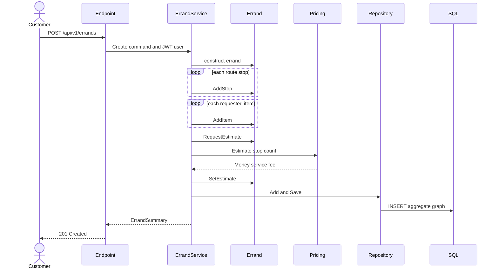

## 9. Matching and job execution sequence

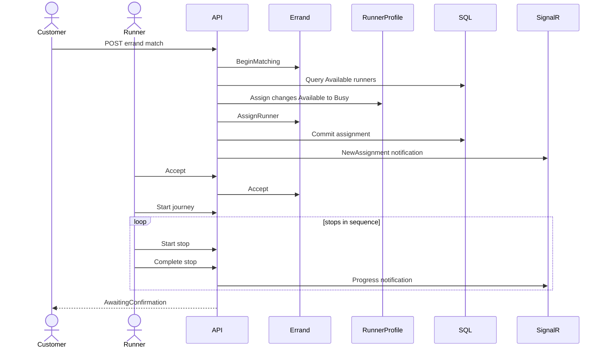

## 10. Completion and earning transaction

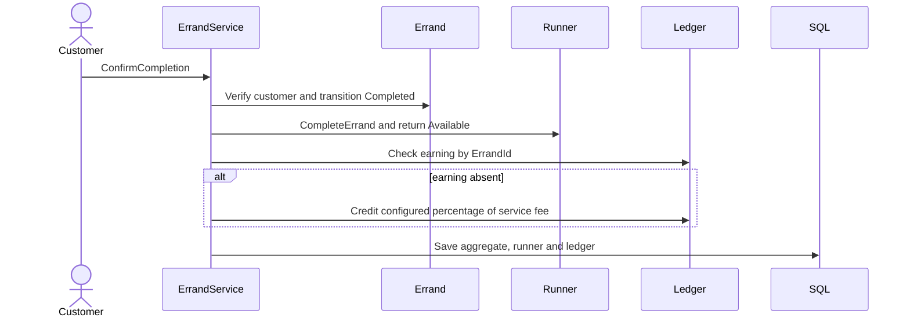

Merchandise money is excluded. With defaults, runner earning is `ServiceFee × 0.80`; the remaining 20% is gross platform share, not net profit.

## 11. Payout algorithm

1. Require verified runner status.
2. Require a non-empty `Idempotency-Key`.
3. Return an existing payout for the same runner/key.
4. Construct positive, currency-valid `Money` values.
5. Load the tokenized payout recipient.
6. Ensure ledger balance covers transfer amount plus configured fee.
7. Persist a Pending payout.
8. Submit transfer to Paystack in kobo.
9. Mark Submitted and append a payout ledger debit.
10. Process signed webhook as Paid, Failed or Reversed.
11. Append one `PayoutReversal` credit for failed/reversed transfers.

The ledger is append-oriented: reversals compensate earlier entries rather than deleting history.

## 12. Messaging and notification sequence

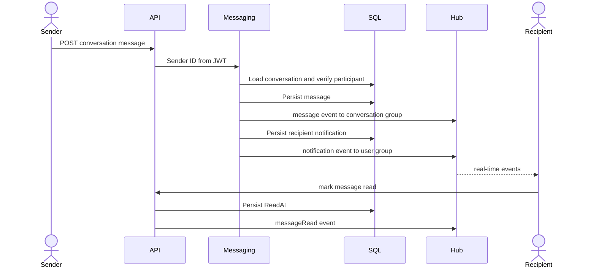

Clients recover missed events by calling REST list/detail endpoints after reconnecting.

## 13. WebRTC signaling flow

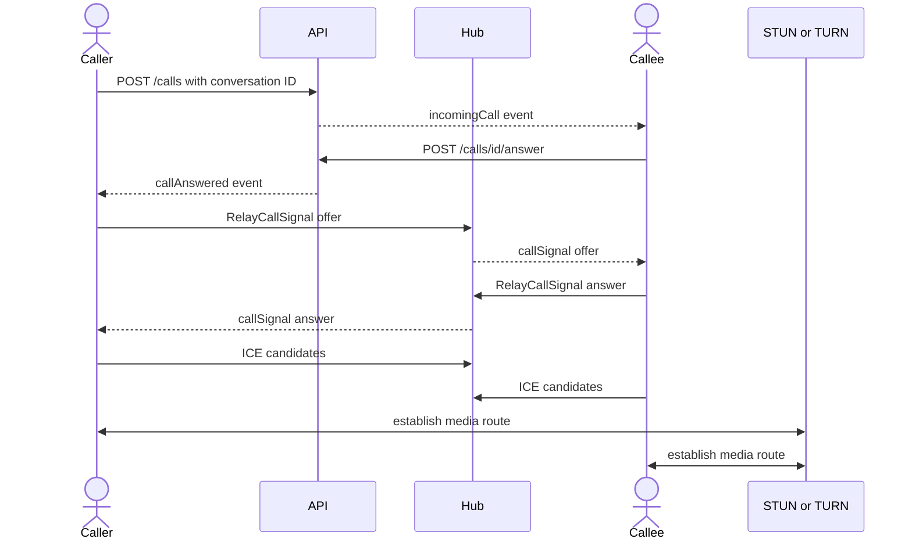

`JoinConversation` must succeed before a connection joins a SignalR conversation group. The hub accepts only `offer`, `answer` and `iceCandidate` signal types.

## 14. API organization

| Route group | Authentication | Purpose |
|---|---|---|
| `/api/v1/auth` | Anonymous or authenticated by operation | Accounts and credentials |
| `/api/v1/errands` | Mostly Customer; selected actions Runner | Customer route and errand lifecycle |
| `/api/v1/runners/me` | Runner | Availability, jobs, earnings and payouts |
| `/api/v1/notifications` | Authenticated owner | Notification inbox and read state |
| `/api/v1/conversations` | Customer/runner participant | Persistent errand messaging |
| `/api/v1/calls` | Conversation participant | Call lifecycle |
| `/hubs/communications` | Authenticated | Real-time events and WebRTC signaling |
| `/api/v1/payments/webhooks/paystack` | HMAC signature | Transfer reconciliation |
| `/health/live`, `/health/ready` | Anonymous | Orchestrator probes |

## 15. Authentication and authorization details

JWTs contain:

- `sub`: application user GUID
- `name`: display name
- `email`: account email
- `role`: `Customer` or `Runner`

Issuer, audience, signature and expiration are validated with a 30-second clock skew. SignalR browser connections may supply JWT through `access_token` only for the communications hub path.

Authorization is deliberately two-stage:

1. Endpoint policies validate authentication and coarse role.
2. Services compare the JWT user ID with CustomerId, RunnerId, RecipientId or conversation membership.

## 16. Error mapping

| Exception | HTTP status |
|---|---:|
| `DomainException` | 409 |
| `KeyNotFoundException` | 404 |
| `UnauthorizedAccessException` | 403 |
| Authentication middleware failure | 401 |
| Unhandled exception | 500 with no internal detail |

Responses use RFC 7807 Problem Details and include a trace ID.

## 17. Consistency and concurrency

- Aggregate mutations use EF change tracking and one scoped DbContext.
- Financial idempotency is backed by unique database indexes.
- Rowversion protects critical mutable records from silent lost updates.
- Messages are stored before real-time broadcast.
- Paystack outcomes are authenticated and reconciled asynchronously.
- Current notification publication is not protected by an outbox; this is the most important reliability improvement before horizontal production scale.

## 18. Testing strategy

| Test type | Current coverage |
|---|---|
| Domain unit tests | Errand invariants, stop ordering, completion, runner state, calls, messages and notification reads |
| Application tests | Pricing, completion-to-earning, payout fee and reversal balance |
| Architecture tests | Forbidden project dependencies |
| Manual HTTP verification | Authentication, customer errands, runner routes, notification API and SignalR negotiation |

Recommended additions are `WebApplicationFactory` integration tests, SQL Server container tests for indexes/rowversion, Paystack contract tests, SignalR two-client tests and load tests for messaging/tracking.
