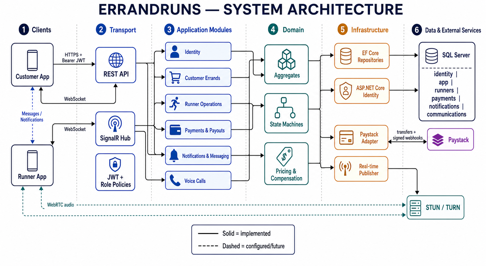
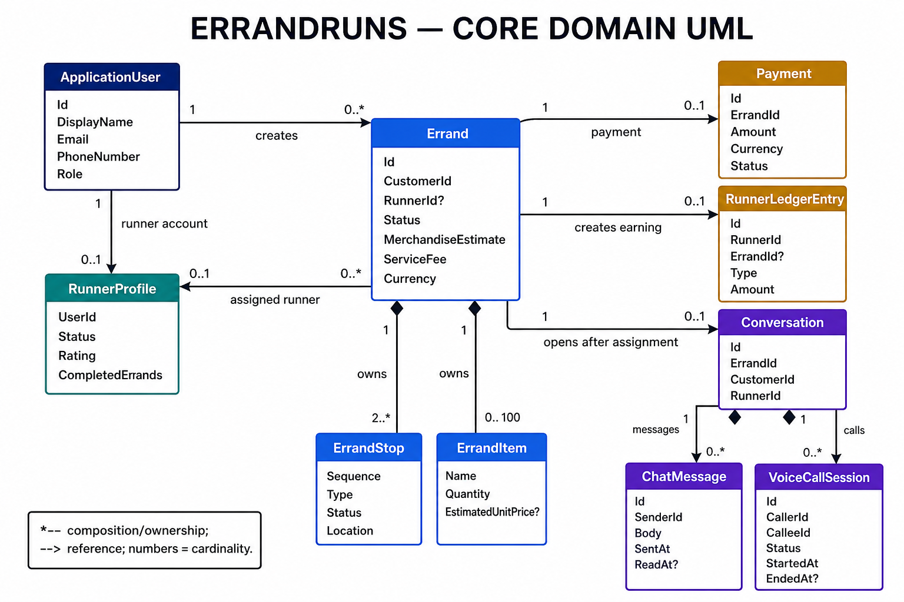
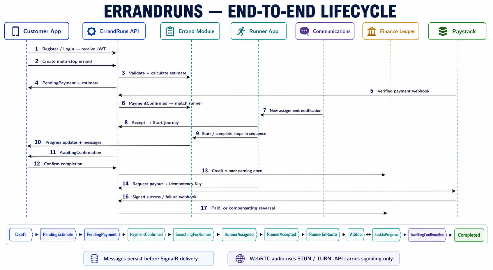

# ErrandRuns UML diagram set

These three views explain the system at different levels. Start with the architecture view, use the domain view to understand the main data relationships, and use the lifecycle view to follow one errand from authentication through runner payout.

## 1. System architecture

This view shows the dependency path from the customer and runner clients through the REST/SignalR transports, application modules, domain model, infrastructure adapters, SQL Server, Paystack, and WebRTC infrastructure.

## 2. Core domain model

This view shows the main aggregates and their cardinalities. `Errand` is the central aggregate: it owns stops and items, belongs to a customer, can be assigned to a runner, and connects to payment, earnings, and a post-assignment conversation.

## 3. End-to-end lifecycle

This view follows the runtime sequence from login and errand creation to payment confirmation, runner execution, customer confirmation, earning creation, and Paystack payout reconciliation. The state strip at the bottom shows the permitted errand progression.

## Reading notes

- REST is the durable control path; SignalR delivers low-latency notifications and messages.
- Messages are persisted before real-time publication, so disconnected clients can retrieve them later.
- The API carries WebRTC signaling and call metadata, but voice audio uses a peer-to-peer STUN/TURN route.
- Runner earnings are credited only after customer completion confirmation.
- Payout webhooks either finalize the payout or create a compensating ledger reversal.
